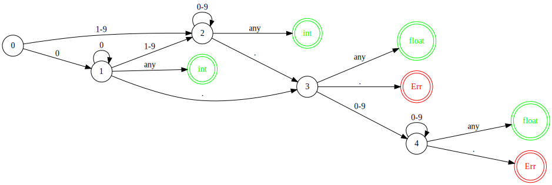

# expression-caculator

> 从编译原理角度求解表达式计算

> 注：以下更多为口语解释，如想了解专业解释麻烦自行 Google/Baidu \(^o^)/~

我们将不依赖语言的形式呈现出表达式的计算过程，为了便于展示，这里会对以下表达式进行验证。

``` js
1. "2 + 2"
2. "2 - 2"
3. "2*3"
4. "1/2"
5. "1/0"
6. " 49 * 63 / 58 * 36 "
7. " 84 + 62 / 33 * 10 + 15 "
8. " 48 + 59 * 86 * 92 * 23 "
9. " 16 + 25 - 92 + 54 / 66 "
10. " 64 + 19 - 77 - 93 "
11. " 88 - 72 + 55 * 57 "
12. " 99 * 55 / 30 + 50 "
13. " 52 * 62 * (  61 + 12 - 14 * 79  ) + 39 "
... // 更多可以查看 __tests__/Calculator.test.ts 中的测试用例
```

## 🤠 一些知识

编译一串字符会经过如下阶段


由于我们要做的Caculator并不需要进行上下文审查，所以我们只需要到语法分析的语法树阶段即可。

我们会接收一段源代码（这里是一段表达式字符串），然后我们通过词法分析将其分析生成符号流（token）

##  🤠 词法分析

> 简单理解下词法分析: 就是输入一堆字符，通过字符的词性，可以生成对应单词（如动词、名词、形容词等）

上图，源代码其实就是**字符流**, 我们通过读取流，又生成**符号流**

> **什么是流？**在编写代码时，我们应该有一些方法将程序像连接水管一样连接起来 – 当我们需要获取一些数据时，可以去通过"拧"其他的部分来达到目的。这也应该是IO应有的方式。 – Doug McIlroy. October 11, 1964

### 🤓 源代码转成流的形式

我们通过迭代器的机制，来实现流，便于我们词法分析时，可以一个个吃掉流。

``` typescript
interface IPeekIterator<T> {
  private it: Generator<T>
  // 流的结束标志位
  private endToken: T | string
  // 被吃过但是未被吃掉的流
  private stackPutBacks: LinkedList<T> // 数组模拟的栈
  // 缓存CACHE_SIZE长度的最新吃掉的流
  private queueCache: LinkedList<T> // 数组模拟的队列
  
  public next: () => T
  public hasNext: () => boolean
  public peek: () => T
  public putBack: () => void
}
```

具体实现可以看 [PeekIterator.ts](./src/PeekIterator.ts)


现在我们已经把源代码字符串形式转成流的形式了，接下来我们进入词性的定义。

可以看下一个`Token`的结构:

``` typescript
interface IToken {
  // 词性 （如：名词/动词)
  type: string
  // 词的内容 (如：狗/叫)
  value: string
}
```

### 🤓 词性

如何定义词性呢？那就看我们的字符流有哪些，我们这次要支持的是四则运算，很简单，可以列举出我们会处理:

1. `number` 
2. `+-*/`
3. `()`

上面三种类型的字符流。

所以最终，我们要生成一个个`Token`，让我们定义下类型:

#### 🤗 TokenTypes

``` typescript
enum TokenTypes {
  NUMBER,
  OPERATOR,
  BRACKET
}
```

####🤗 Token

``` typescript
class Token {
  type: TokenTypes
  value: string
  constructor(type: TokenTypes, value: string) {
    this.type = type
    this.value = value
  }
}
```

因为`number`的长度不限，所以我们需要引入有限状态机，来处理流，而不是一个个流吃成`Token`,比如：

`"12+32-1"`应该输出为`12`、`+`、`32`、`-`、`1`而不是`1`、`2`、`+` 、`3`、 `2`、 `-`、 `1`


### 🤓 有限状态机

> 有限状态自动机拥有有限数量的状态，每个状态可以迁移到零个或多个状态，输入字串决定执行哪个状态的迁移。

这里`operator`和`bracket`都是一位，所以一个状态变化，因此用不到状态机处理。让我们看下`number`的状态图:



根据状态图，我们可以简单的写出对应的`token`生成函数，具体可以看 [token/makeXXX](./src/lexer/Token.ts)


## 🤠 语法分析

到了这步，我们已经把字符流转换成了符号流，距离成功又近了一步。

> 大家都造过句吧，给定一些词语，使用这些词语，我们根据对应的语法规则可以造出句子，这个也就是语法分析。
>
> 而这里也就是转换成抽象语法树

这里会涉及的知识点：

``` shell
1. 递归向下
2. 左递归、消除左递归
3. 产生式
4. 终结符和非终结符
```

数学里，学过四则运算，进行运算的是`+-*/`也就是括号不参与，所以我们在语法分析阶段，将不会把括号生成抽象语法树的节点。


### tokens转成符号流的形式

这里我们会实现 `PeekTokenIterator` 把tokens转换成流。

``` typescript
interface IPeekTokenIterator extends IPeekIterator {
  // 通过 value 来匹配 token
  nextMatch: (value) => Token
  // 通过 type 来匹配 token
  nextMatch1: (type) => Token
}
```

具体实现可以参看[这里](./src/PeekTokenIterator.ts) 


### 🤓 抽象语法树

产生式: `Expr -> Expr + Expr | Factor`

这里Factor表示的是这些数字，Expr表示表达式运算。

简单理解就是: `1 + 1 + 1 +1`可以分析为 

1. `Expr(1+1+1) + Expr(1) | Factor`
2. `Expr(1) -> Factor -> 1`

所以`Expr`可以向下递归`Expr` 求解

这里我们先定义下抽象语法树的节点类型: `ASTNode` `Expr` `Factor`; [具体可以看](./src/parser/astNode)


