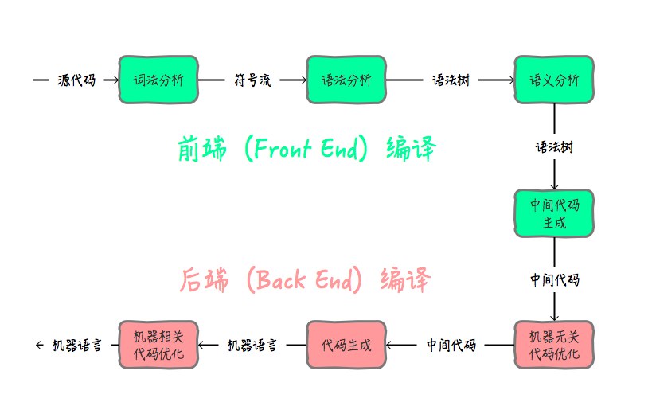
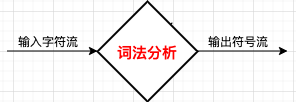

# expression-caculator

> 从编译原理角度求解表达式计算

> 注：以下更多为口语解释，如想了解专业解释麻烦自行 Google/Baidu \(^o^)/~

我们将不依赖语言的形式呈现出表达式的计算过程，为了便于展示，这里会对以下表达式进行验证。

``` js
1. "2 + 2"
2. "2 - 2"
3. "2*3"
4. "1/2"
5. "1/0"
6. " 49 * 63 / 58 * 36 "
7. " 84 + 62 / 33 * 10 + 15 "
8. " 48 + 59 * 86 * 92 * 23 "
9. " 16 + 25 - 92 + 54 / 66 "
10. " 64 + 19 - 77 - 93 "
11. " 88 - 72 + 55 * 57 "
12. " 99 * 55 / 30 + 50 "
13. " 52 * 62 * (  61 + 12 - 14 * 79  ) + 39 "
... // 更多可以查看 __tests__/Calculator.test.ts 中的测试用例
```

## 🤠 一些知识

编译一串字符会经过如下阶段



由于我们要做的Caculator并不需要进行上下文审查，所以我们只需要到语法分析的语法树阶段即可。

我们会接收一段源代码（这里是一段表达式字符串），然后我们通过词法分析将其分析生成符号流（token）

##  🤠 词法分析

> 简单理解下词法分析: 就是输入一堆字符，通过字符的词性，可以生成对应单词（如动词、名词、形容词等）

上图，源代码其实就是**字符流**, 我们通过读取流，又生成**符号流**

> **什么是流？**在编写代码时，我们应该有一些方法将程序像连接水管一样连接起来 – 当我们需要获取一些数据时，可以去通过"拧"其他的部分来达到目的。这也应该是IO应有的方式。 – Doug McIlroy. October 11, 1964

### 🤓 源代码转成流的形式

我们通过迭代器的机制，来实现流，便于我们词法分析时，可以一个个吃掉流。

``` typescript
interface IPeekIterator<T> {
  private it: Generator<T>
  // 流的结束标志位
  private endToken: T | string
  // 被吃过但是未被吃掉的流
  private stackPutBacks: LinkedList<T> // 数组模拟的栈
  // 缓存CACHE_SIZE长度的最新吃掉的流
  private queueCache: LinkedList<T> // 数组模拟的队列
  
  public next: () => T
  public hasNext: () => boolean
  public peek: () => T
  public putBack: () => void
}
```

具体实现可以看 [PeekIterator.ts](./src/PeekIterator.ts)

